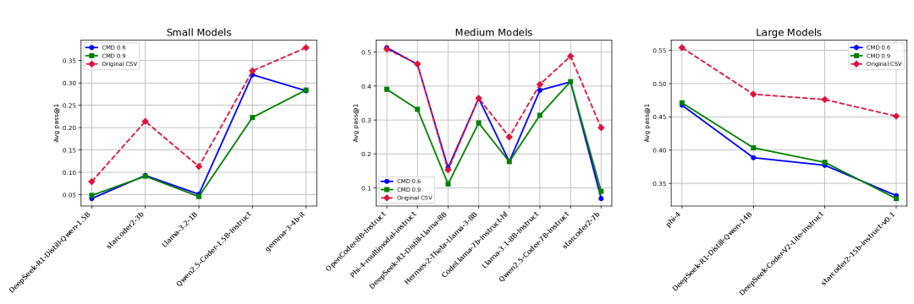
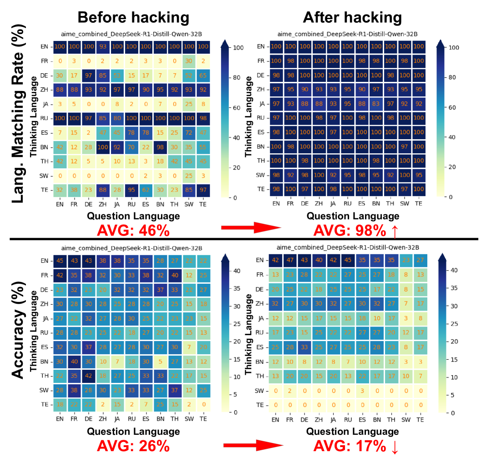
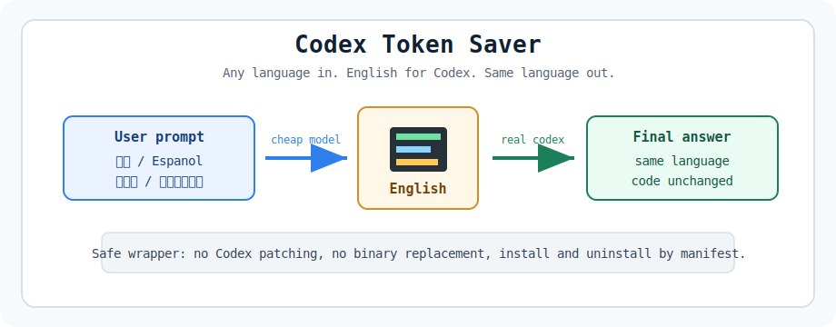

# TokTrans

[](https://github.com/lyymuwu/TokTrans/actions/workflows/ci.yml)
[](LICENSE)
[](https://github.com/openai/codex)

<p align="center">
  <strong>When Codex feels weaker outside English, it may not be your prompt. It may be the language boundary.</strong>
</p>

<table>
  <tr>
    <td width="50%">
      <h3>Codex feels less sharp?</h3>
      <p>Same repo, same bug, same intent, but the answer misses context or needs more back-and-forth when the task is not written in English.</p>
    </td>
    <td width="50%">
      <h3>Your quota vanishes too fast?</h3>
      <p>Some languages spend more visible tokens before reasoning even starts, leaving less room for the actual task.</p>
    </td>
  </tr>
</table>

TokTrans adds an explicit translation boundary around Codex. It translates the user-facing text that enters or leaves a Codex run while preserving code, paths, logs, commands, stack traces, JSON/YAML/TOML, and quoted literals.

It does not replace Codex, patch the official `codex` binary, or force you to work in English. You keep writing in your language; Codex gets a cleaner task; the final answer comes back in your language.

## Evidence

Tokenizer behavior is not language-neutral. Aran Komatsuzaki's tokenizer experiment uses English as the 1x baseline and shows that non-English prompts can consume substantially more tokens. TestingCatalog's write-up reports that Chinese, Japanese, and Hindi use 44% to 65% more tokens than English in Claude 3.7 Sonnet, while tokenizers optimized for Asian languages behave very differently.

<p align="center">
  <a href="https://x.com/arankomatsuzaki/status/2049177688402022730">
    
  </a>
</p>

Source: [Aran Komatsuzaki on X](https://x.com/arankomatsuzaki/status/2049177688402022730), with an accessible summary in [TestingCatalog](https://testingcatalog.net/claudes-65-token-premium-for-chinese-is-a-hard-lesson-in-tokenizer-bias/).

Quality is affected too. [CodeMixBench](https://arxiv.org/abs/2505.05063) (2025) evaluates code generation on English-only prompts versus controlled code-mixed prompts built from BigCodeBench. In the figure below, the red dashed line is the original English prompt baseline, while the blue and green lines are code-mixed prompts. Most blue/green points sit below the red baseline, showing that mixed-language instructions often reduce Pass@1 even when the underlying programming task is the same.



Figure source: CodeMixBench, Figure 1.

[When Models Reason in Your Language](https://arxiv.org/abs/2505.22888) (EMNLP Findings 2025) studies large reasoning models on multilingual math and science questions. The figure below has two stories:

- The top row measures whether the model's hidden thinking trace matches the requested language. Stronger language-control prompting raises the average matching rate from 46% to 98%.
- The bottom row measures answer accuracy on the same setting. That stronger language control drops average accuracy from 26% to 17%.

This is the trade-off TokTrans is designed around: forcing the model to reason in the user's language can make the trace more readable, but it can also make the answer worse. TokTrans instead takes the pragmatic path: translate the task into a Codex-ready form, preserve technical tokens, let the model work in its stronger reasoning regime, then translate only the final answer back.



Figure source: When Models Reason in Your Language, Figure 2.

TokTrans exists because multilingual technical work needs a practical translation boundary, not because every task should be translated. The impact depends on the model, tokenizer, language, and task.

## What You Get

- `$token-trans`: an explicit Codex skill for in-app agent workflows.
- `codex-ts`: a safe wrapper for terminal automation and `codex exec`.
- Technical-token preservation for code, paths, logs, stack traces, commands, and structured data.
- Final-answer translation back into the user's language.
- No patching or replacement of the official `codex` binary.



## Quick Start

Install only the native Codex skill:

```bash
curl -fsSL https://raw.githubusercontent.com/lyymuwu/TokTrans/main/scripts/bootstrap.sh | bash -s -- --skill-only
```

Use it inside Codex:

```text
$token-trans 帮我检查这个项目为什么测试失败
```

The skill path is explicit, lightweight, and does not wrap `codex` or modify your shell PATH.

## Optional CLI Wrapper

Install the skill plus `codex-ts`:

```bash
curl -fsSL https://raw.githubusercontent.com/lyymuwu/TokTrans/main/scripts/bootstrap.sh | bash
```

Then open a new shell or run:

```bash
source ~/.zshrc
codex-ts doctor
```

Use `codex-ts` for terminal automation, shell pipelines, or a drop-in command around `codex exec`:

```bash
codex-ts exec "请帮我检查这个仓库为什么测试失败"
codex-ts exec "このプロジェクトのREADMEをもっと魅力的にして"
echo "请总结这个错误日志" | codex-ts exec -
```

Inspect-first install:

```bash
git clone https://github.com/lyymuwu/TokTrans.git
cd TokTrans
./scripts/install.sh
```

Wrapper-only install:

```bash
curl -fsSL https://raw.githubusercontent.com/lyymuwu/TokTrans/main/scripts/bootstrap.sh | bash -s -- --no-skill
```

## How It Works

```text
user task
  -> translator preserves technical tokens
  -> Codex-ready task
  -> main Codex work
  -> final answer translated back
```

Use TokTrans for multilingual coding, debugging, research, and ops tasks where natural-language instructions matter. Use plain Codex for short one-line chats or prompts that are mostly code, paths, and logs.

## Safety

- The official `codex` binary is never patched or replaced.
- `codex-ts` is a separate wrapper command.
- `$token-trans` uses `fork_context: false` for translator subagents.
- Translation prompts preserve code blocks, inline code, commands, paths, API names, filenames, JSON/YAML/TOML, stack traces, and quoted literals.
- Translator subagents must not receive repository history, files, credentials, API keys, or unrelated context.
- If translation fails, the wrapper falls back to raw Codex and the skill continues without TokTrans.

## Configuration

Default wrapper config:

```text
~/.toktrans/config.toml
```

<details>
<summary>Default values</summary>

```toml
enabled = true
provider = "codex_cli"
model = "gpt-5-nano"
codex_model = "gpt-5.4-mini"
base_url = "https://api.openai.com/v1"
api_key_env = "OPENAI_API_KEY"
source_language = "auto"
target_language = "English"
min_non_english_ratio = 0.25
mode = "auto"
detect_latin_languages = true
translate_final_only = true
fallback_on_error = "passthrough"
show_savings_report = true
timeout_seconds = 45
debug_save_text = false
```

</details>

`provider = "codex_cli"` reuses your Codex account and quota. To use an OpenAI-compatible endpoint:

```toml
provider = "openai"
model = "gpt-5-nano"
base_url = "https://api.openai.com/v1"
api_key_env = "OPENAI_API_KEY"
```

## Verify

```bash
codex-ts doctor
python3 -m unittest discover -s tests
```

Visible-token estimates are heuristic and shown only as debugging information for wrapper runs.

## Uninstall

```bash
~/.toktrans/scripts/uninstall.sh --dry-run
~/.toktrans/scripts/uninstall.sh
~/.toktrans/scripts/uninstall.sh --purge --yes
```

The uninstaller removes only manifest-managed files. It preserves config and logs unless `--purge --yes` is used.

## Development

```bash
python3 -m unittest discover -s tests
shellcheck scripts/*.sh scripts/codex-ts
python3 scripts/benchmark_visible_tokens.py
```

Release artifacts should include repository files only. Never bundle local config, logs, tokens, `.env` files, or `install-manifest.json`.

## License

MIT
